<div align="center">

# Boardwright

Draft board and card layouts, export a build-ready spec

[![Live][badge-site]][url-site]
[![HTML5][badge-html]][url-html]
[![CSS3][badge-css]][url-css]
[![JavaScript][badge-js]][url-js]
[![Claude Code][badge-claude]][url-claude]
[![License][badge-license]](LICENSE)

[badge-site]:    https://img.shields.io/badge/live_site-0063e5?style=for-the-badge&logo=googlechrome&logoColor=white
[badge-html]:    https://img.shields.io/badge/HTML5-E34F26?style=for-the-badge&logo=html5&logoColor=white
[badge-css]:     https://img.shields.io/badge/CSS3-1572B6?style=for-the-badge&logo=css3&logoColor=white
[badge-js]:      https://img.shields.io/badge/JavaScript-F7DF1E?style=for-the-badge&logo=javascript&logoColor=black
[badge-claude]:  https://img.shields.io/badge/Claude_Code-CC785C?style=for-the-badge&logo=anthropic&logoColor=white
[badge-license]: https://img.shields.io/badge/license-MIT-404040?style=for-the-badge

[url-site]:   https://boardwright.neorgon.com/
[url-html]:   #
[url-css]:    #
[url-js]:     #
[url-claude]: https://claude.ai/code

</div>

---

## Overview

Boardwright turns a board game you are still designing into something a coding
agent can build. Lay out the board as named zones, lay out each card format as
slots on a face, then declare the parts a picture cannot show: who owns a zone,
who can see into it, what order the phases run in, which moves are legal, and how
the game ends. The export is a single archive holding reference renders, a JSON
model, and a written brief that ties them together.

The difference from a card designer is the readiness check. Before anything
leaves, Boardwright reads the design back and reports what an engine could not be
generated from: a deck nothing draws from, a zone that fills and never empties, an
action that moves nothing, a game with no way to end. Those findings do not block
the export. They travel inside it as open questions, so the agent building the
game asks instead of quietly inventing a rule.

**Live:** boardwright.neorgon.com

---

## Features

- **Free-form zone board** -- drag and resize named regions in board units, with
  ten zone kinds that carry meaning: deck, market, hand, tableau, discard, supply,
  track, slot, score, area
- **Zones an engine can model** -- each one declares an owner (shared, per player,
  active player), a visibility (public, owner only, hidden), a capacity, and which
  components or card templates it holds
- **Card template editor** -- slots positioned as percentages of the face, so the
  spec survives any print size or screen the implementer picks; six poker-to-tarot
  size presets, or set the millimetres directly
- **A rules model, not rules notes** -- components with counts, ordered turn
  phases, actions declared as a move from one zone to another with a cost and an
  effect, and end conditions with the trigger that gets evaluated
- **Readiness check** -- fourteen structural questions run continuously and
  separate what blocks a build from what is merely worth confirming
- **Reference renders** -- board and card PNGs where every rectangle is labelled
  with the same id the JSON uses, so a reader can match the picture to the model
- **One-click bundle** -- `game.json`, `board.png`, `cards/*.png`, `BRIEF.md` and
  `PROMPT.txt` in a single archive, built in the browser
- **Local and portable** -- designs live in localStorage, and the JSON export is
  also the import format, so a design moves between machines as one file
- **Keyboard driven** -- digits switch views, arrows nudge the selection, Cmd/Ctrl+D
  duplicates, Cmd/Ctrl+Z undoes, and a drag collapses into a single undo step

---

## What the export contains

| File | What it is |
|---|---|
| `game.json` | The model, versioned. Zones, components, templates, phases, actions, end conditions. |
| `board.png` | Board reference at full board units, every zone labelled with its id. |
| `cards/<name>.png` | Face reference per template. Dashed rectangles are slots, labelled with their key. |
| `BRIEF.md` | The same model in prose: a suggested state shape, tables per section, and the open questions the design left. |
| `PROMPT.txt` | The message to send along with the bundle. |

---

## Running locally

ES modules require an HTTP server (not `file://`):

```bash
make serve
```

Then open http://localhost:8866.

---

## Architecture



```
boardwright-site/
├── index.html            # Shell: header, view tabs, five view sections
├── css/
│   └── style.css         # Site styles; tokens come from the CDN base.css
└── js/
    ├── app.js            # Entry point, first-run sample
    ├── model.js          # The design shape: zone kinds, field types, factories, migrate
    ├── state.js          # One design in memory, localStorage, undo, change channels
    ├── board.js          # Board view: zone stage, rail, inspector
    ├── cards.js          # Cards view: template list, card face, slot inspector
    ├── rules.js          # Rules view: components, phases, actions, end conditions
    ├── lint.js           # Readiness checks, pure over the model
    ├── report.js         # Check and Export views
    ├── export.js         # game.json, BRIEF.md, PROMPT.txt, bundle assembly
    ├── image.js          # Canvas renderers for the board and card references
    ├── zip.js            # Store-only ZIP writer, no dependencies
    ├── drag.js           # Shared rect drag and resize engine
    ├── forms.js          # Declarative form builder used by every editor
    ├── sample.js         # Harvest Run, the worked example
    ├── render.js         # View router
    ├── events.js         # Wiring
    ├── modal.js          # Focus-trapped dialog
    └── utils.js          # Helpers
```

---

<div align="center">
<sub>Part of <a href="https://neorgon.com/">Neorgon</a></sub>
</div>
